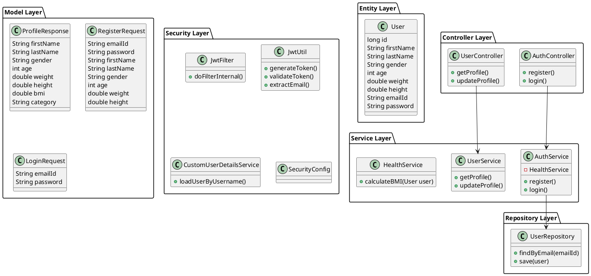

# SwasthaTrack

SwasthaTrack is a personal health companion that helps users monitor their overall well-being through basic health analysis, cycle tracking, and AI-powered meal suggestions.

---

## 🚀 Features

### 1. 🧠 Basic Health Analysis

Analyze your body health using simple inputs.

**Input:**

* Age
* Gender
* Height (in cm)
* Weight (in kg)

**Output:**

* BMI (Body Mass Index)
* Category:

  * Underweight
  * Normal
  * Overweight

---

### 2. 🍽️ AI-Based Meal Suggestions

Get personalized meal recommendations based on your preferences and goals.

**Input:**

* Gender
* Allergies
* Goal:

  * Weight Loss
  * Maintain
  * Weight Gain

**Output:**

* Simple daily meal plan including:

  * Breakfast
  * Lunch
  * Dinner
  * Snacks

---

### 3. 🌸 Cycle Tracking

Track menstrual cycles and stay informed about your health.

**Input:**

* Last Period Date
* Cycle Length (in days)

**Output:**

* Next Expected Cycle Date
* Delay detection:

  * Alerts if cycle is delayed by more than 10 days

---

### 4. 🔔 Smart Alerts

Stay proactive with intelligent reminders and suggestions.

**Alerts:**

* “Cycle delayed, take care”
* “Try these natural remedies”

---

## 🏗️ Tech Stack

* **Backend:** Spring Boot (Java)
* **Database:** PostgreSQL
* **AI Integration:** OpenAI API
* **Frontend:** React

---

## 📦 Project Structure (Backend)

---

## 🔄 API Overview

### Health Analysis

---

## 🧠 Future Enhancements
---

## 💡 Vision

SwasthaTrack aims to go beyond basic tracking and evolve into a holistic health assistant that supports physical, mental, and lifestyle well-being.

## Class Diagram

#### Code

  
View class diagram code

